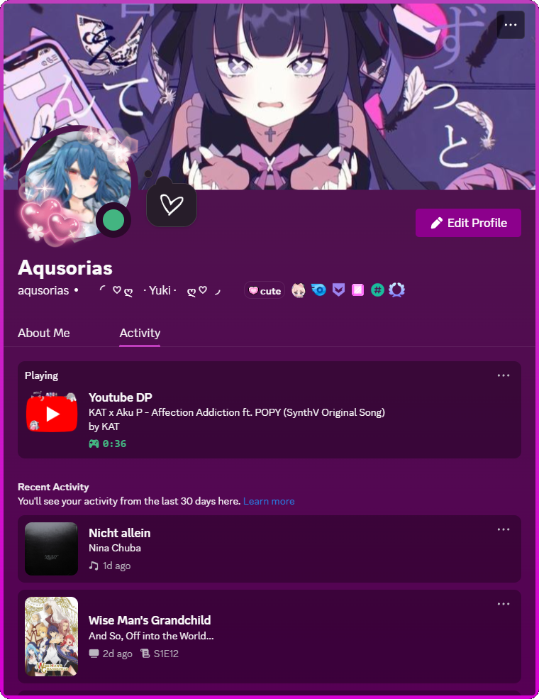

# 📦 YouTube Discord Rich Presence

A native messaging bridge and extension integration that displays your current YouTube video activity as Discord Rich Presence — including video title, channel name, and playback status — directly in your Discord profile.


|  |  |
|:---------------------:|:---------------------|


## 📖 Table of Contents

- [Requirements](#️-requirements)
- [Installation](#installation)

## 🛠️ Requirements

- **[Node.js](https://nodejs.org/en)** (v16 or higher recommended)
- **npm** (comes with Node.js)
- **Firefox** (for native messaging extension)
- **Discord** desktop app (for Rich Presence)

## Installation

> **_NOTE:_**   currently takes manual installation with batch files & isn't on the Firefox ADD-ONS Browser
1. **Clone the repository**
   ```bash
   git clone https://github.com/Aqusorias/Youtube-Discord-Rich-Presence.git
   cd Youtube-Discord-Rich-Presence
   ```
2. **Run the setup script (Windows only)**
    ```bash
    setup.bat
    ```
    This will:
    - Check for Node.js and npm.
    - Install necessary dependencies.
    - Create the required Windows registry key for native messaging.
    - Generate the native messaging manifest file.
3. **Add Extension to Firefox**
This step will later be removed with the addition to the ADD-ONS Browser, but for now:
- Go to `about:debugging#/runtime/this-firefox` in Firefox
- Press on `Load Temporary Add-on...`
- Select the `manifest.json` in ./Extension/
You have to do this each time you re-open Firefox with a temporary Extension.