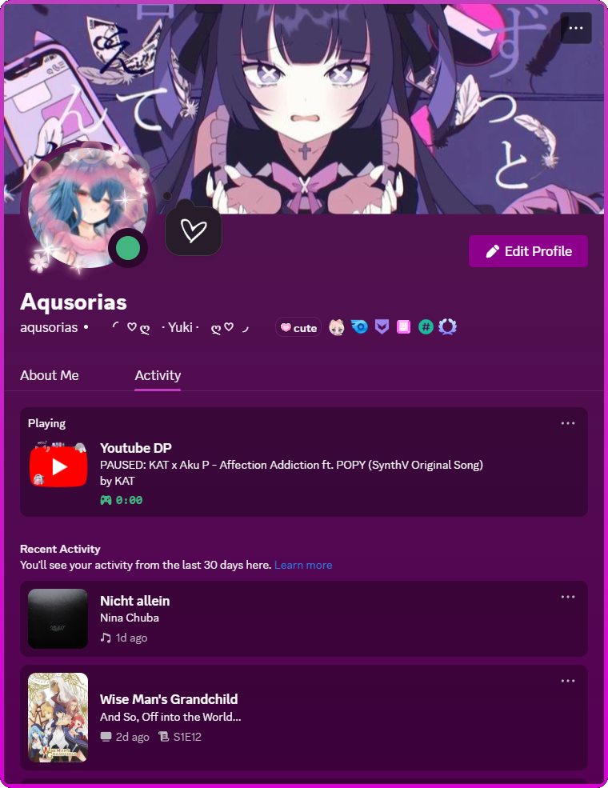

# 📦 YouTube Discord Rich Presence

A native messaging bridge and extension integration that displays your current YouTube video activity as Discord Rich Presence — including video title, channel name, and playback status — directly in your Discord profile.

When paused, it will display the amount of time the video has been paused, starting from 0. The other timestamp will continuously reflect the current runtime position of the video.

|  |  |
|:---------------------:|:---------------------|

(The title is "Youtube", not "Youtube DP": will change these images soon)

## 📖 Table of Contents

- [Requirements](#️-requirements)
- [Installation](#installation)
- [Known Issues](#-known-issues)
- [Planned Features](#-planned-features)

## 🛠️ Requirements

- **[Node.js](https://nodejs.org/en)** (v16 or higher recommended)
- **npm** (comes with Node.js)
- **Firefox** (for native messaging extension)
- **Discord** desktop app (for Rich Presence)

## Installation

1. **Download the latest `.exe` from Github Releases**
   Download and run the "YoutubeDiscordRPC_Setup" from the [Releases](https://github.com/Aqusorias/Youtube-Discord-Rich-Presence/releases) section.
2. **Install the Extension from Firefox Add-ons**
Visit the offical extension page and install it directly: https://addons.mozilla.org/en-US/firefox/addon/youtube-discord-rich-presence/

> NOTE: If you had the extension installed before the app, you may need to restart your browser for it to work.

## 🛑 Known Issues

- Sometimes on Video playback, it shows the wrong Channelname. This should fix itself on the next Video playback.
- It behaves weirdly if you have multiple Tabs running with different Videos. It should show the title and channel of the latest opened tab and playtime.
    - If you then stop any other Youtube tab, by closing it in any way, it will stop the RPC. This will fix itself on Video change or Window Reload.
    - Pausing and Resuming any other Youtube tab, it will break the timestamp. The times won't allign, and it always shows the title and channel of the newest created Video. This will fix itself on Video Change or Window Reload.

If you find any other Problems, feel free to open a Issue.

## 📌 Planned Features

- An extension Popup for the Extension with settings and a way to reload.
- A setting to disable Discord Rich Presence updates for one specific tab.
- Have different Thumbnails in the Rich Presence.
- A way to customize all text fields displayed in the Rich Presence.